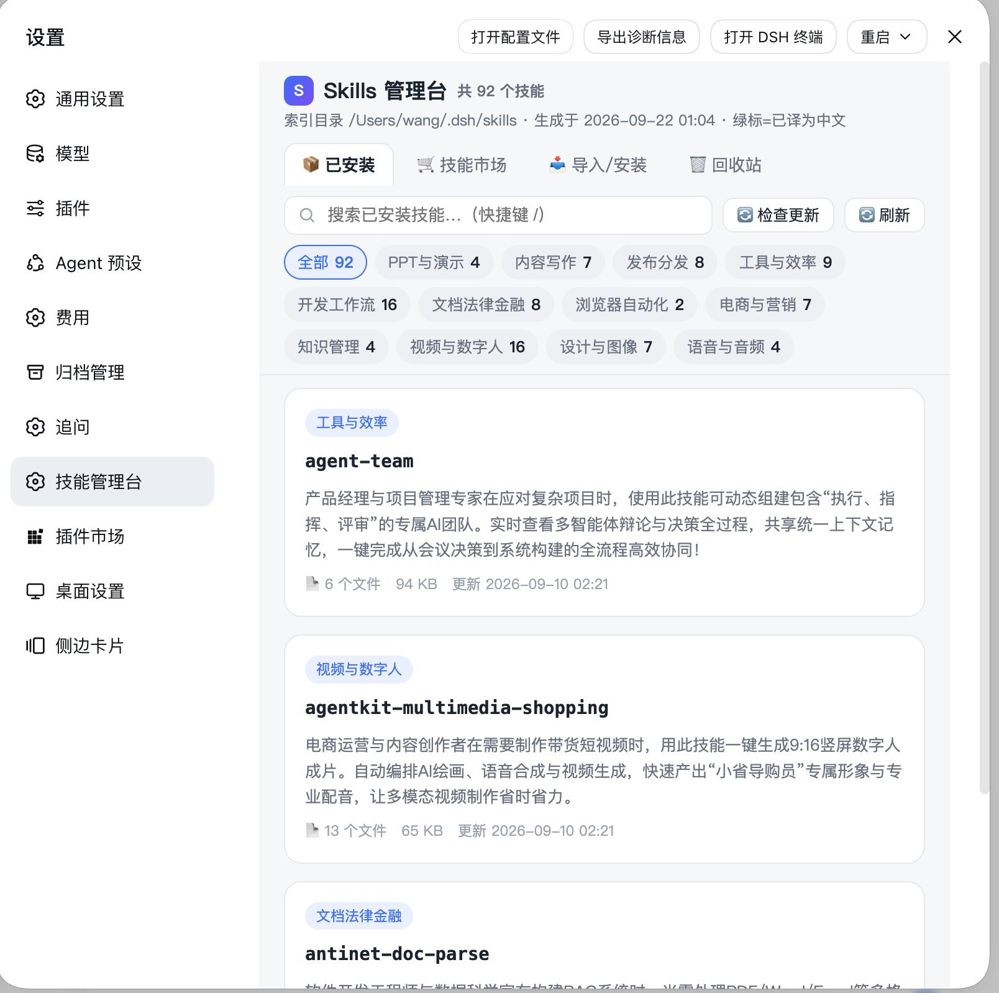

# dsh-plugin-skills-manager

[中文](#简介) | [English](#english)

**DSH Desktop 的技能管理台插件** —— 在 DSH 界面内浏览、搜索、安装你的全部 Agent Skills，内置技能市场与中文翻译。

<a id="简介"></a>
## 简介

DSH Desktop 支持在 `~/.dsh/skills` 放置大量 Agent Skills（SKILL.md 格式），但技能一多就难以管理。本插件在 DSH 设置页提供一个完整的「技能管理台」：

- 📦 **已安装**：实时浏览全部技能，按分类筛选、关键词搜索，查看完整简介（英文技能自动显示中文翻译）、版本、依赖与目录结构
- 🛒 **技能市场**：分类筛选 + 分页（每页 20/50/100/全部），一键浏览/搜索/安装
  - [Anthropic 官方技能库](https://github.com/anthropics/skills)（目录浏览）
  - [Superpowers 技能库](https://github.com/obra/superpowers)（社区经典技能集）
  - [ClawdHub 社区市场](https://clawdhub.com)（关键词搜索，数千社区技能）
  - 任意 GitHub 仓库（`owner/repo[/子路径]`），可**保存为常驻自定义源**
- ⚡ **对话框技能选择器**：输入框旁 ⚡ 按钮弹出技能列表，点击即插入 `/技能名` 调用
- 📥 **导入**：从 Claude Code / Codex / OpenCode 或任意本机目录把技能复制进 `~/.dsh/skills`
- 📦 **批量安装**：一次粘贴多个 GitHub 仓库或 npm 包名（空格/逗号/分号分隔），自动识别包内全部技能
- 📋 **一键调用**：复制「让 Agent 加载」提示词，粘贴到对话即可按该技能执行
- 🗑 **一键卸载**：界面直接卸载技能，默认移入回收目录防误删
- 🗑 **回收站**：已卸载技能可找回或彻底删除
- 🔔 **更新检查**：自动定时（每 6 小时）+ 手动检查技能是否有新版本，红点提示 + 卡片「可更新」徽章 + 一键更新（GitHub 源用 Git blob SHA 对比，零额外配额；ClawdHub 源对比 zip 内 SKILL.md）
- 🔗 **来源绑定**：手动放置的技能可绑定到 GitHub 仓库（`owner/repo[/子路径]`），绑定后同样参与更新检查；市场安装的技能自动记录来源
- 🌐 **中文翻译**：英文简介自动机器翻译成中文（多翻译源回退 + 本地缓存），也可在 `translations/zh.json` 手工维护
- 🔄 **刷新 / 自愈**：顶部「🔄 刷新」重新扫描；页面轮询索引代次，过期自动刷新，杜绝旧页面残留



## 安装

> ⚠️ 必须在 **DSH Desktop 完全退出后**执行安装脚本（脚本会强制检查）。

```bash
git clone https://github.com/gzsxy/dsh-plugin-skills-manager.git
cd dsh-plugin-skills-manager
bash install.sh
```

启动 DSH Desktop 后：**设置 → 技能管理台**。

卸载：`bash uninstall.sh`。

## 技能市场

| 源 | 说明 |
|---|---|
| Anthropic 官方技能库 | [anthropics/skills](https://github.com/anthropics/skills)，Git Trees API + 10 分钟缓存，配额消耗极低；支持 `GITHUB_TOKEN` 提升限额 |
| Superpowers 技能库 | [obra/superpowers](https://github.com/obra/superpowers) 的 `skills/` 目录 |
| ClawdHub 社区市场 | [clawdhub.com](https://clawdhub.com) 的 `/api/v1/search`（limit≤100）与 `/api/v1/download` |
| 自定义源 | 在「任意 GitHub 仓库」中浏览后点「💾 存为常驻源」，持久化于 `.skills-manager/sources.json`，可随时删除 |

安装管线：下载（tar/zip）→ 路径安全校验（拒绝 `../`、绝对路径）→ SKILL.md 有效性校验 → 写入 `~/.dsh/skills/<name>` → 记录来源（`.skills-manager/provenance.json`）。同名技能会询问是否覆盖。

## API

| 路由 | 说明 |
|---|---|
| `GET /api/skills-manager/index` | 已安装技能索引（含 `description_zh`、`origin`） |
| `GET /api/skills-manager/dashboard` | 管理台页面 |
| `GET /api/skills-manager/market/sources` | 市场源列表 |
| `GET /api/skills-manager/market/list?source=&path=&q=` | 浏览 GitHub 源目录 |
| `GET /api/skills-manager/market/search?source=clawdhub&q=` | ClawdHub 搜索 |
| `POST /api/skills-manager/market/install` | 安装技能（参数见源码注释） |
| `POST /api/skills-manager/uninstall` | 卸载技能 `{name}`，默认移入回收目录；`{name, permanent:true}` 彻底删除 |
| `POST /api/skills-manager/market/sources/add` | 添加自定义源 `{name, repo, path}` |
| `POST /api/skills-manager/market/sources/remove` | 删除自定义源 `{id}`（仅 custom- 开头可删） |
| `GET /api/skills-manager/trash` | 回收站列表 |
| `POST /api/skills-manager/trash/restore` | 找回 `{entry}` |
| `POST /api/skills-manager/trash/delete` | 彻底删除 `{entry}` |
| `GET /api/skills-manager/update/status` | 更新检查缓存状态 |
| `POST /api/skills-manager/update/check` | 立即执行一次更新检查 |
| `POST /api/skills-manager/update/apply` | 一键更新 `{name}`（从来源重新安装并覆盖） |
| `POST /api/skills-manager/bind` | 手动技能绑定来源 `{name, repo, subPath?}`，参与更新检查 |
| `POST /api/skills-manager/unbind` | 解除绑定 `{name}` |
| `POST /api/skills-manager/uninstall` | 卸载技能 `{name}`，默认移入回收目录；`{name, permanent:true}` 彻底删除 |

## 架构

```
├── package.json          # dsh.bundle.patch + dsh.client 声明
├── cordis.patch.yml      # cordis 插件挂载
├── index.js              # 服务端：技能扫描 + 翻译合并 + 市场 API（cordis 插件，inject webServer）
├── client.js             # 浏览器端：设置页注册（ModuleLoader + slots，inject: ["slots"]）
├── dashboard/index.html  # 管理台前端（无框架单文件）
├── translations/zh.json  # 中文翻译表
└── install.sh / uninstall.sh
```

## 迭代开发

`install.sh` 以 **file: 拷贝**方式安装，并**自动递增 patch 版本**——这是有意为之：pnpm 对 file: 依赖在版本不变时会跳过文件刷新。

```bash
# 修改源码后：
# 1) 完全退出 DSH Desktop
# 2) bash install.sh
# 3) 启动 DSH Desktop
```

补充中文翻译：编辑 `translations/zh.json` 后刷新页面即生效（无需重装）。

## 安全说明

- 本插件安装后会以你的用户权限运行，请只从可信来源安装技能
- 市场安装会校验压缩包路径安全并验证 SKILL.md 结构，但**不审核技能内容本身**
- 安装/卸载必须退出 DSH：脚本会在 DSH 运行时拒绝执行，避免 profile 竞态导致启动异常

<a id="english"></a>
## English

A DSH Desktop plugin providing a full skill manager: browse/search all installed Agent Skills in `~/.dsh/skills` with automatic Chinese translation of English descriptions, plus a built-in skill marketplace (Anthropic official skills, ClawdHub community market, any GitHub repo) with safe install (tarball/zip path validation + SKILL.md verification + provenance tracking). Install with `bash install.sh` while DSH Desktop is fully quit; the entry appears under **Settings → 技能管理台**.

## License

MIT
